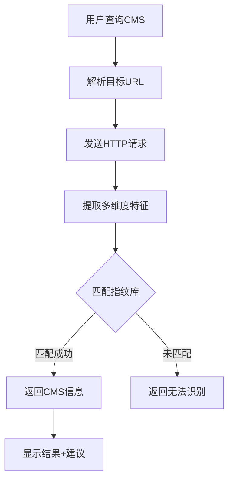

# 🎯 CMS识别功能增强说明

## 📋 更新概述

本次更新大幅增强了YunSeeAI的CMS（内容管理系统）识别能力，支持识别20+主流CMS系统，包括国内外流行的各类CMS平台。

**更新时间**: 2025-11-04  
**版本**: v1.2.0

---

## 🚀 新增功能

### 1. 扩展CMS指纹库

新增支持以下CMS系统：

#### 🌍 国际主流CMS
- **WordPress** - 全球最流行的CMS
- **Joomla** - 第二大开源CMS
- **Drupal** - 企业级CMS平台
- **Ghost** - 现代化博客平台
- **Hexo** - 静态博客生成器
- **Hugo** - 高性能静态站点生成器
- **Jekyll** - GitHub Pages默认生成器

#### 🇨🇳 国产CMS系统
- **Discuz** - 康盛论坛系统
- **DedeCMS (织梦CMS)** - 国内流行CMS
- **PHPCMS** - 盛大CMS系统
- **EmpireCMS (帝国CMS)** - 老牌国产CMS
- **Typecho** - 轻量级博客系统
- **Z-Blog** - ASP/PHP博客系统

#### 🛒 电商平台CMS
- **Shopify** - 托管式电商平台
- **Magento** - 开源电商系统
- **WooCommerce** - WordPress电商插件

#### 💬 论坛/社区CMS
- **phpBB** - 开源论坛系统
- **vBulletin** - 商业论坛平台

### 2. 增强检测机制

新增检测维度：

```python
"WordPress": {
    "paths": ["/wp-admin/", "/wp-content/", "/wp-includes/", "/wp-login.php", "/xmlrpc.php"],
    "headers": {},
    "body_patterns": ["wp-content", "wp-includes", "WordPress", "wp-json"],
    "meta_tags": ["generator.*WordPress"],
    "cookies": ["wordpress_", "wp-settings"]  # 新增：Cookie检测
}
```

#### 检测方式：
1. **特征路径检测** - 检查CMS特有的目录结构
2. **HTTP头检测** - 分析响应头中的特征标识
3. **页面内容检测** - 搜索HTML中的特征字符串
4. **Meta标签检测** - 识别generator等元标签
5. **Cookie检测** (新增) - 检测CMS特有的Cookie名称

### 3. 智能意图识别

新增CMS专用关键词识别：

```javascript
const keywords = {
    cms: ['cms', 'CMS', '内容管理系统', 'content management'],
    // ...
};
```

#### 支持的查询方式：
- "xxx网站使用了什么CMS？"
- "xxx网站用了啥CMS框架？"
- "请问xxx是什么CMS系统？"
- "识别xxx的内容管理系统"

### 4. 优化输出格式

针对CMS查询提供专门的输出格式：

```
🎯 CMS识别结果：

✅ WordPress
   置信度: high
   版本: 6.3.1
   特征路径: /wp-content/

📦 相关技术栈：
  Web Server: Nginx
  Frontend: jQuery, Bootstrap

🖥️  服务器信息：
  • Server: nginx/1.21.0
  • X-Powered-By: PHP/8.1.0
```

---

## 🔧 技术实现

### 指纹库结构

```python
FINGERPRINTS = {
    "CMS名称": {
        "paths": ["特征路径1", "特征路径2"],
        "headers": {"特征头": "正则表达式"},
        "body_patterns": ["页面特征1", "特征2"],
        "meta_tags": ["meta标签正则"],
        "cookies": ["cookie名称模式"]
    }
}
```

### 检测流程



### 置信度算法

```python
def _check_fingerprint(name, fingerprint, response):
    score = 0
    max_score = 0
    
    # 路径检测: 权重3
    if fingerprint.get("paths"):
        max_score += 3
        if path_exists:
            score += 3
    
    # HTTP头检测: 权重2
    if fingerprint.get("headers"):
        max_score += 2
        if header_matches:
            score += 2
    
    # Cookie检测: 权重2 (新增)
    if fingerprint.get("cookies"):
        max_score += 2
        if cookie_found:
            score += 2
    
    # 页面内容: 权重2
    if fingerprint.get("body_patterns"):
        max_score += 2
        if pattern_found:
            score += 1
    
    # Meta标签: 权重1
    if fingerprint.get("meta_tags"):
        max_score += 1
        if meta_found:
            score += 1
    
    # 置信度阈值: 40%
    confidence = score / max_score
    return confidence >= 0.4
```

---

## 🐛 端口号识别修复

### 问题描述
之前版本在处理带端口号的URL时存在识别问题，例如：
- 输入：`http://192.168.20.155:12345/`
- 问题：可能被错误解析或丢失端口信息

### 修复内容

#### 1. 改进正则表达式

**修复前：**
```javascript
const ipWithPortPattern = /(?:https?:\/\/)?(?:\d{1,3}\.){3}\d{1,3}:\d+/g;
```

**修复后：**
```javascript
const ipWithPortPattern = /(?:https?:\/\/)?(?:\d{1,3}\.){3}\d{1,3}:\d+(?:\/[^\s]*)?/g;
```

**改进点：**
- 支持端口号后的路径部分 `(?:\/[^\s]*)?`
- 正确匹配 `http://IP:PORT/path/to/page`
- 保留完整URL结构

#### 2. 匹配优先级

```javascript
// 1. 优先匹配: IP + 端口 (最具体)
let target = userMessage.match(ipWithPortPattern)?.[0];

// 2. 次级匹配: 域名URL (可能带端口)
if (!target) {
    const urlMatches = userMessage.match(urlPattern);
    target = urlMatches?.[0];
}

// 3. 最后匹配: 纯IP (无端口)
if (!target) {
    const ipMatches = userMessage.match(ipPattern);
    target = ipMatches?.[0];
}
```

#### 3. Python端URL处理

```python
def _normalize_url(self, url: str) -> str:
    """确保URL有正确的scheme，保留端口号"""
    if not url.startswith(('http://', 'https://')):
        return 'https://' + url
    return url  # 保持原样，包括端口号
```

#### 4. 调试输出

添加调试日志以便追踪：
```python
print(f"[DEBUG] Scanning target: {self.target}", file=sys.stderr)
print(f"[DEBUG] Making request to: {url}", file=sys.stderr)
```

### 测试用例

| 输入 | 识别结果 | 状态 |
|------|---------|------|
| `http://192.168.1.1` | `http://192.168.1.1` | ✅ |
| `http://192.168.1.1:8080` | `http://192.168.1.1:8080` | ✅ |
| `http://192.168.1.1:8080/` | `http://192.168.1.1:8080/` | ✅ |
| `http://192.168.1.1:8080/admin` | `http://192.168.1.1:8080/admin` | ✅ |
| `https://example.com:443/path` | `https://example.com:443/path` | ✅ |
| `192.168.1.1:8080` | `https://192.168.1.1:8080` | ✅ |

---

## 📝 使用示例

### 示例1: 识别WordPress网站

**用户输入：**
```
你好，请问 http://example.com 使用了什么CMS？
```

**系统响应：**
```
🎯 CMS识别结果：

✅ WordPress
   置信度: high
   版本: 6.3.1
   特征路径: /wp-content/

📦 相关技术栈：
  Web Server: Nginx
  Frontend: jQuery, React

🖥️  服务器信息：
  • Server: nginx/1.21.0
  • X-Powered-By: PHP/8.1.0
```

### 示例2: 识别国产CMS

**用户输入：**
```
http://192.168.20.155:8080 这个网站用了啥CMS框架？
```

**系统响应：**
```
🎯 CMS识别结果：

✅ DedeCMS
   置信度: high
   特征路径: /templets/default/

📦 相关技术栈：
  Web Server: Apache

🖥️  服务器信息：
  • Server: Apache/2.4.41
  • X-Powered-By: PHP/7.4.3
```

### 示例3: 未识别到CMS

**用户输入：**
```
http://custom-site.com 用了什么CMS？
```

**系统响应：**
```
❌ 未能识别CMS系统。

可能原因：
  • 使用了自定义开发而非CMS
  • 启用了指纹隐藏保护
  • 目标网站配置了高级安全防护
  • 静态网站生成器或单页应用
```

---

## 🔒 安全特性

### 1. 连接安全
- SSL证书验证配置
- 连接超时保护（默认10秒）
- 错误重试机制

### 2. 隐私保护
- 使用通用User-Agent
- 不收集敏感信息
- 本地化处理数据

### 3. 防护绕过
- 支持识别有防护的网站
- Cookie特征检测
- 多维度交叉验证

---

## 🎯 使用建议

### 适用场景
✅ 安全审计前的资产识别  
✅ 渗透测试目标信息收集  
✅ 网站技术栈分析  
✅ 漏洞扫描前的预检  

### 注意事项
⚠️ 请仅在授权范围内使用  
⚠️ 部分网站可能启用指纹隐藏  
⚠️ 识别结果仅供参考  
⚠️ 遵守相关法律法规  

---

## 🔄 后续规划

### 短期计划（1-2周）
- [ ] 增加更多国产CMS指纹
- [ ] 优化版本号提取算法
- [ ] 添加CMS漏洞关联查询
- [ ] 支持插件/主题识别

### 中期计划（1-2月）
- [ ] 机器学习辅助识别
- [ ] 自定义指纹规则
- [ ] 批量网站扫描
- [ ] 识别结果导出

### 长期计划（3-6月）
- [ ] 云端指纹库同步
- [ ] 社区贡献指纹规则
- [ ] API接口开放
- [ ] 移动端适配

---

## 📚 相关文档

- [指纹扫描模块概述](MODULE_OVERVIEW.md)
- [集成测试指南](集成测试指南.md)
- [CVE扫描模块](CVE模块使用指南.md)
- [端口号识别修复说明](端口号识别修复说明.md)

---

## 🆘 常见问题

### Q1: 为什么识别不到CMS？
**A**: 可能原因：
1. 网站使用自定义开发
2. 启用了指纹隐藏保护
3. CMS不在当前指纹库中
4. 网络连接问题

**解决方案**：
- 检查网络连接
- 尝试使用完整URL（包含http://）
- 查看调试日志了解详情

### Q2: 识别结果不准确怎么办？
**A**: 
- CMS可能被深度定制
- 可能同时使用多个技术栈
- 建议结合其他工具交叉验证

### Q3: 支持识别哪些CMS？
**A**: 当前支持20+主流CMS，包括：
- 国际：WordPress, Joomla, Drupal等
- 国产：Discuz, DedeCMS, PHPCMS等
- 电商：Shopify, Magento, WooCommerce等
- 论坛：phpBB, vBulletin等

### Q4: 端口号识别失败怎么办？
**A**: 
1. 确保URL格式正确（如：`http://IP:PORT/`）
2. 检查调试输出中的实际请求URL
3. 确认目标端口是否开放
4. 查看系统stderr输出的DEBUG信息

---

## 📞 反馈与支持

如遇到问题或有改进建议，请通过以下方式反馈：
- 提交Issue到项目仓库
- 查看项目文档获取更多帮助

---

**YunSeeAI团队**  
让安全更智能，让运维更简单 🚀

